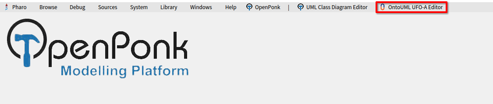
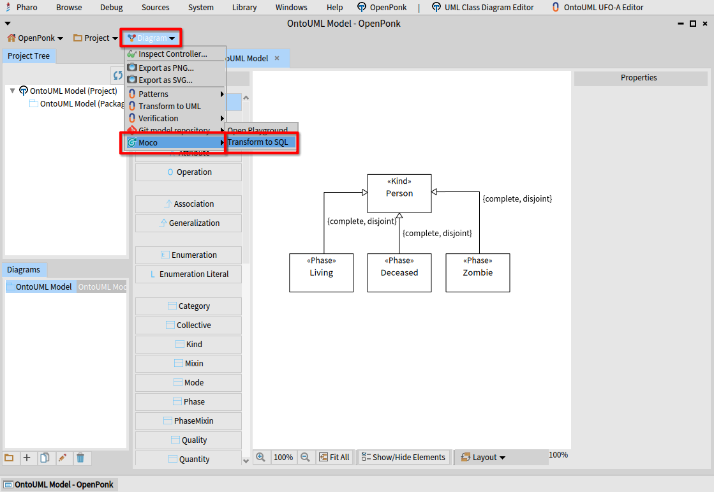
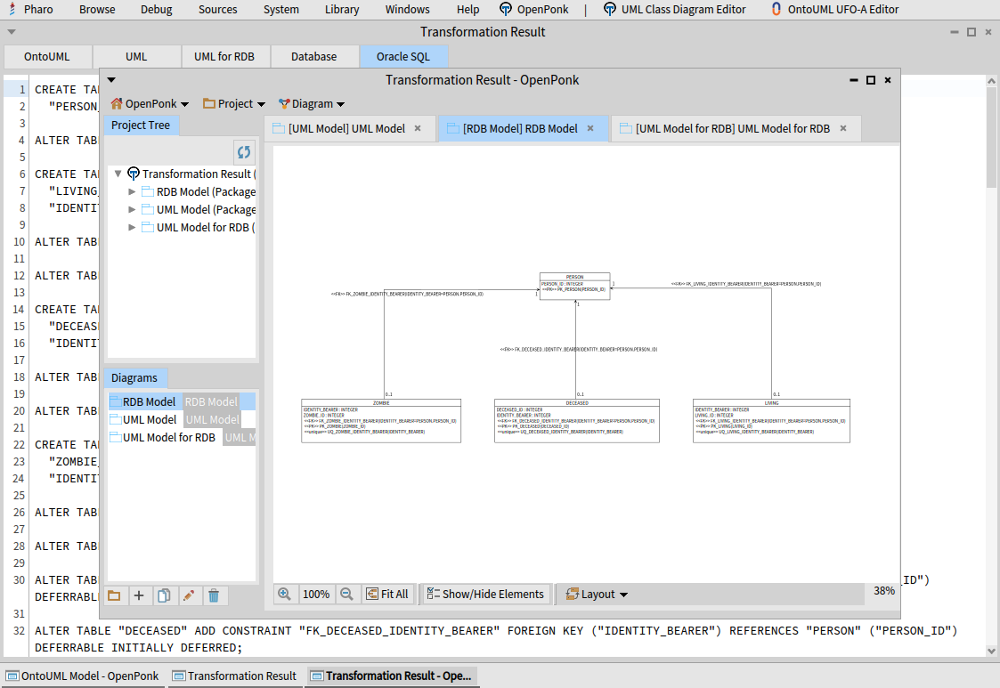

= Moco

Moco{empty}footnote:moco[Moco is an acronym for “model converter”.] is a library that implements automated transformation of an OntoUML model to SQL.

== Features

The library can transform any valid OntoUML model into a SQL script that instantiates an empty database, which can store data described by the conceptual model. All constraints implied by the OntoUML model are transformed to database triggers to ensure data consistency.

The transformation is executed in three stages:

1. **OntoUML to UML.** All class and relationship stereotypes are supported, supports optimization of phases, roles, relators and generalization sets.
2. **UML to RDB.** Classes, attributes, associations, generalizations, generalization sets and enumerations are supported.
3. **RDB to SQL.** Tables, columns, primary, unique, foreign keys and derived OCL constraints are supported.

Moco supports PostgreSQL and Oracle as the target relational database platform.

== Usage

This library is primarily intended to be used as a plugin to https://openponk.org/[OpenPonk] — a modeling tool that supports OntoUML. A prebuilt distribution of OpenPonk that includes Moco is available at https://gitlab.fit.cvut.cz/jaburjak/openponk-moco[gitlab.fit.cvut.cz/jaburjak/openponk-moco].

The transformation can be invoked by menu _Diagram_ » _Moco_ » _Transform to SQL_.

The target SQL platform can be selected in the Settings Browser.

=== Manual Installation

You can use Metacello to load the library, as shown below. Moco can be used even outside OpenPonk; in that case, you won’t be able to use the `Moco-OpenPonk` package.

[source,smalltalk]
----
Metacello new baseline: 'Moco';
	repository: 'github://jaburjak/moco:main';
	load.
----

Currently, OpenPonk nightly released on 2024/03/02 and Pharo 11 are supported.

== License

Created by Jakub Jabůrek, released under the MIT License. Please see the https://github.com/jaburjak/moco/blob/main/LICENSE[LICENSE] file for more information.

== Acknowledgements

The approach for the transformation of OntoUML to SQL was developed by Dr. Zdeněk Rybola in his Ph.D. thesis __Towards OntoUML for Software Engineering: Transformation of OntoUML into Relational Databases__ (2017).
